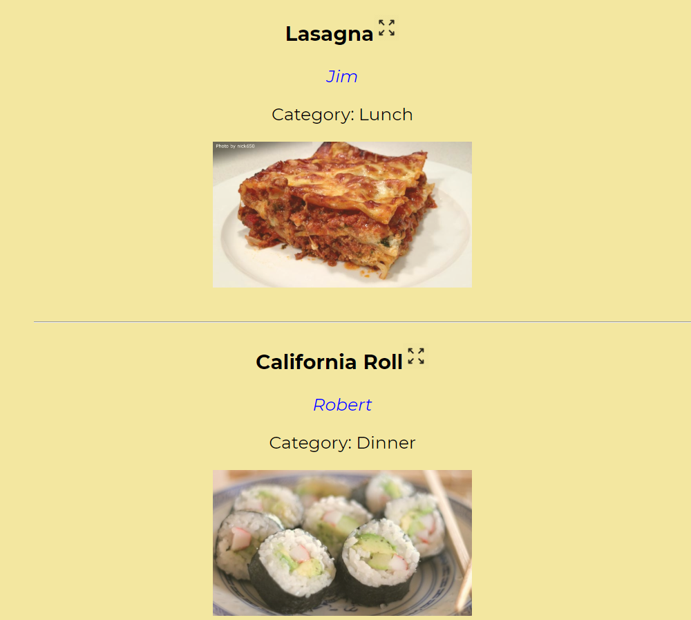
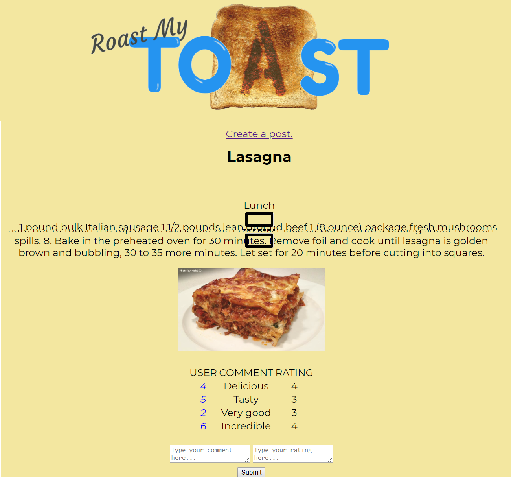
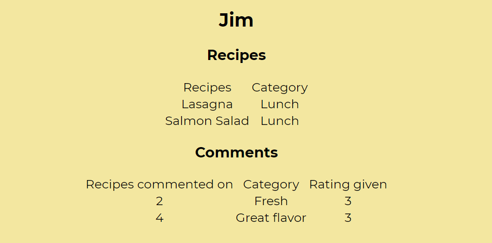
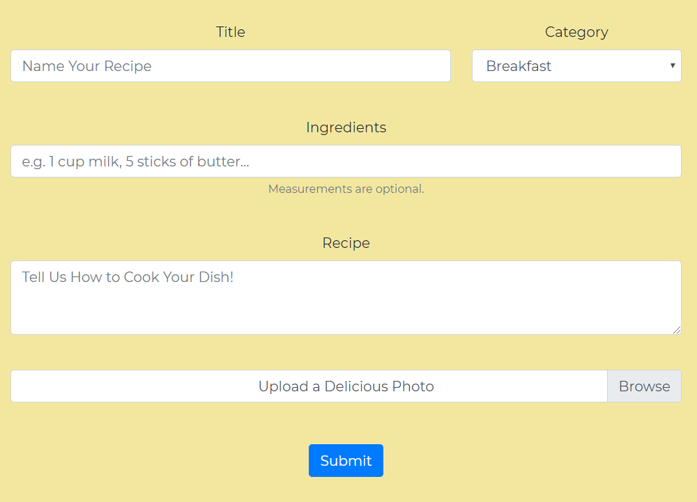

# Welcome

To [*Roast My Toast*](https://project-0002.herokuapp.com), a recipe board where users can dish on each others' dish!

This App was designed to inspire our inner chefs to discover new recipes, share our inspirations with others, post comments and track the ratings, while keeping everything organized in just one place.

This project was worked on by Giovanna Roman, Kemp Atkinson, and Fahad Alam.

*Roast My Toast* allows you to:

 Post recipes, along with ingredients, instructions, and an image.

 Rate other users' recipes.

 Leave comments on recipes. Roast away, but **be nice**. Mods like to hand out lifetime bans.

# Home

Here we display all of our recipes, displayed in a container dynamically created as it is pulled from our database. Hitting the title will expand the container to display the full recipe (shortened below), along with a chart of user comments and ratings, and a comment box:

# Users

Clicking on a username will bring up their profile, along with their recipe submissions, comments, and ratings given.

# Posting

Users can use the *Roast My Toast* submission form to contribute to the sites recipe database, as well as adding a photo.

# Resources Used

 Sequelize, MySQL2, DotENV

 jQuery, Express

 Animsition plug-in

 Bootstrap framework

 MS Paint
