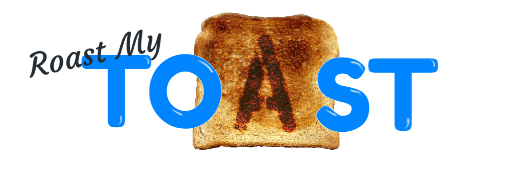

# Function

*Roast My Toast* allows users to:

 Post recipes, along with ingredients, instructions, and an image.

 Rate other users' recipes.

 Leave comments on recipes.

# Database

# Routes

# Resources Used

 Sequelize, MySQL2, DotENV

 jQuery, Express

 Animsition plug-in

 Bootstrap framework

 MS Paint
